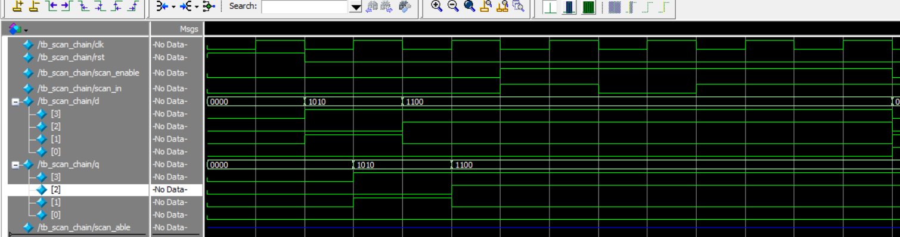
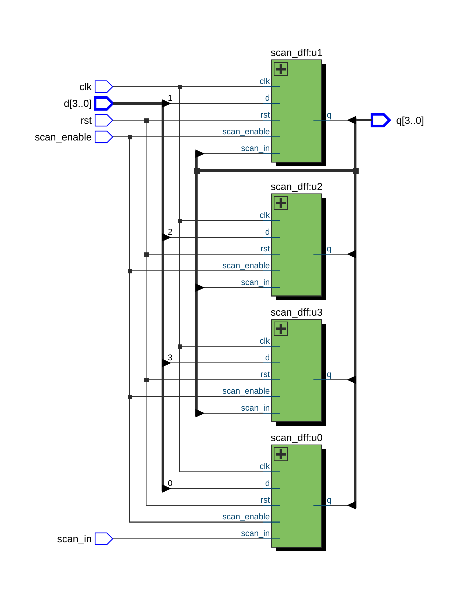

# 🧪 DFT Practice — Scan Chain Design (Verilog RTL + ModelSim)

This project demonstrates a 4-bit **scan chain** design using Verilog.  
It consists of four scan D flip-flops connected in series, supporting both **normal** and **scan** modes.  
Simulation was done in ModelSim, and RTL schematic was generated using Quartus Prime.

---

## 📊 Simulation Waveform



---

## 📐 RTL Diagram



---

## 🛠 Toolchain

- **Quartus Prime Lite 18.0**
- **ModelSim - Intel FPGA Starter Edition 10.5b**

---

## 📁 Folder Structure

```
DFT_Scan_Chain/
├── scan_dff.v             # Scan DFF module (reused)
├── scan_chain.v           # Top module connecting 4 scan DFFs in series
├── tb_scan_chain.v        # Testbench for simulation
├── wave_tb_scan_chain.png # ModelSim waveform output
└── RTL_scan_chain.png     # Quartus RTL schematic
```
---

## ✍️ Author

Huichingchang  
April 2025
